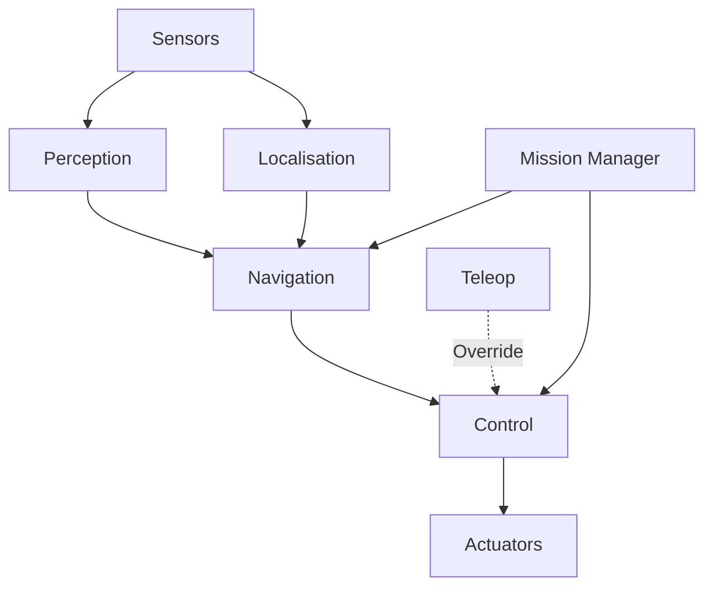

## Introduction

The Innex1 Rover is built on ROS 2 Humble and follows a modular architecture designed for the NASA Lunabotics competition. The system is designed to autonomously navigate lunar terrain, excavate regolith, and deposit material in collection bins.

## Design Principles

<CardGroup cols={2}>
  <Card title="Modularity" icon="cubes">
    Each package handles a distinct responsibility with well-defined interfaces
  </Card>
  <Card title="Testability" icon="flask">
    Simulation-first development with Gazebo Fortress enables rapid iteration
  </Card>
  <Card title="Reliability" icon="shield">
    Dual EKF localisation and sensor fusion for robust state estimation
  </Card>
  <Card title="Extensibility" icon="puzzle-piece">
    Shared interface contracts allow independent package development
  </Card>
</CardGroup>

## System Layers

The Innex1 Rover architecture is organized into four primary layers:

### 1. Hardware Abstraction Layer

- **Robot Description**: URDF/XACRO models define the physical robot structure
- **Simulation Bridge**: ROS-Gazebo bridge for sensor and actuator simulation
- **Hardware Interfaces**: Standardized interfaces for motors, sensors, and actuators

### 2. Perception and State Estimation

- **Sensor Processing**: Camera, LiDAR, and IMU data processing
- **Localisation**: Dual EKF setup with AprilTag correction
- **Mapping**: RTAB-Map for visual SLAM
- **Hazard Detection**: Real-time obstacle identification from point clouds

### 3. Planning and Control

- **Path Planning**: Nav2 integration with SMAC planner for obstacle avoidance
- **Motion Control**: Regulated pure pursuit controller for trajectory following
- **Mission Actions**: High-level excavate and deposit action servers

### 4. Mission Management

- **System Bringup**: Orchestrates node launch and configuration
- **Teleoperation**: Manual override for testing and emergency control
- **State Management**: Mission state coordination (deferred to future release)

## Data Flow Architecture

<Note>
The system uses a publish-subscribe architecture where nodes communicate via ROS 2 topics and actions, enabling loose coupling between components.
</Note>

## Key Subsystems

### Localisation Pipeline

The rover employs a dual Extended Kalman Filter (EKF) configuration:

1. **Local EKF** (`odom` → `base_footprint`): Provides smooth, continuous odometry using wheel encoders, IMU, and visual odometry
2. **Global EKF** (`map` → `odom`): Integrates AprilTag detections for absolute position correction and drift compensation

<Tip>
This dual EKF approach prevents sudden jumps in the base_footprint frame while allowing the global map frame to correct for accumulated drift.
</Tip>

### Navigation Stack

The rover uses Nav2 with custom configurations:

- **Planner**: SMAC Planner (State Lattice) for non-holonomic path planning
- **Controller**: Regulated Pure Pursuit for smooth trajectory tracking
- **Costmap**: 2D occupancy grid from LiDAR and depth camera data

### Mission Execution

High-level mission tasks are implemented as ROS 2 actions:

- **Excavate Action**: Navigates to excavation zone, operates bucket mechanism
- **Deposit Action**: Transports material to collection bin and deposits

## Communication Protocols

### Topics

- **Sensor Data**: Raw sensor streams (e.g., `/camera/image_raw`, `/scan`)
- **State Information**: Odometry, transforms, and filtered state estimates
- **Control Commands**: Velocity commands to actuators

### Actions

- **Mission Tasks**: Long-running operations with feedback (excavate, deposit)
- **Navigation Goals**: Move-to-pose commands via Nav2 action interface

### Services

- **Configuration**: Runtime parameter updates
- **State Queries**: Request current system state

## Interface Contracts

The system enforces interface contracts via CI validation:

- Contract definitions in `.github/contracts/interface_contracts.json`
- Ensures topic names, message types, and TF frames remain consistent
- Prevents breaking changes during refactoring

<Note>
See the [Packages](/architecture/packages) page for detailed descriptions of each ROS 2 package.
</Note>

## Simulation Environment

The rover is developed and tested in Gazebo Fortress:

- **Physics Engine**: ODE for realistic dynamics simulation
- **Sensors**: Simulated cameras, LiDAR, IMU, and GPS
- **Terrain**: Moon yard environment with regolith physics
- **Headless Mode**: Default configuration for resource efficiency

### Visualisation Tools

<CardGroup cols={3}>
  <Card title="RViz2" icon="eye">
    Standard ROS visualisation for sensor data and robot state
  </Card>
  <Card title="Gazebo Web" icon="globe">
    Browser-based world geometry and arena layout viewer
  </Card>
  <Card title="Foxglove Studio" icon="chart-line">
    Advanced telemetry and time-series data visualisation
  </Card>
</CardGroup>

## Development Workflow

1. **Local Development**: Edit code with symlink install (no rebuild required for Python/launch files)
2. **Simulation Testing**: Validate changes in Gazebo before hardware deployment
3. **Interface Validation**: CI checks ensure contract compliance
4. **Integration Testing**: Full system validation in moon yard simulation

<Tip>
Use `colcon build --symlink-install` to enable rapid iteration without rebuilding for most file changes.
</Tip>

## External Dependencies

The rover builds on several key ROS 2 packages:

- **robot_localization**: Dual EKF implementation
- **Nav2**: Navigation stack (planner, controller, costmap)
- **RTAB-Map**: Visual SLAM for mapping
- **apriltag_ros**: Fiducial marker detection
- **ros_gz**: ROS-Gazebo integration bridge
- **Leo Rover**: Base robot description and simulation (vendored)

## Coordinate Frames

The system uses the REP-105 standard for coordinate frame conventions:

- `map`: Fixed global reference frame
- `odom`: Continuous odometry frame (accumulates drift)
- `base_footprint`: Robot ground projection (2D navigation)
- `base_link`: Robot center of mass
- Sensor frames: Camera, LiDAR, IMU (defined in URDF)

<Note>
For detailed TF tree structure, see the [TF Frames](/architecture/tf-frames) page.
</Note>