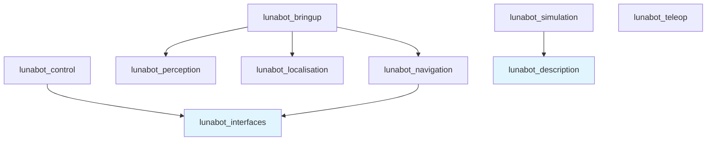

## Package Overview

The Innex1 Rover software is organized into nine specialized ROS 2 packages, each handling a distinct aspect of the robot's functionality. This modular structure enables parallel development, easier testing, and clear separation of concerns.

## Core Packages

### lunabot_bringup

<Card title="System Launch and Configuration" icon="rocket">
  System-level launch files and robot bringup orchestration
</Card>

**Purpose**: Provides the top-level launch infrastructure to start all rover subsystems in the correct order with proper configuration.

**Key Responsibilities**:
- Launch file orchestration for complete system startup
- Parameter configuration management
- Node lifecycle coordination
- Integration of navigation, localisation, and perception stacks

**Key Dependencies**:
- `robot_localization`: EKF state estimation
- `nav2_bringup`: Navigation stack launch
- `lunabot_navigation`: Path planning integration
- `lunabot_perception`: Vision and sensor nodes

**Typical Usage**:
```bash
ros2 launch lunabot_bringup full_system.launch.py
```

<Tip>
This package is the entry point for starting the complete rover system. All other packages are typically launched through bringup launch files.
</Tip>

---

### lunabot_control

<Card title="Motion and Material Control" icon="gamepad">
  Robot control algorithms and motion control nodes
</Card>

**Purpose**: Implements control algorithms for robot motion and material handling (excavation bucket, conveyor, etc.).

**Key Responsibilities**:
- Material action server (excavate and deposit actions)
- Low-level motor control interfaces
- Bucket mechanism control
- Velocity command processing

**Published Topics**:
- `/mission/excavate` (action server): `lunabot_interfaces/action/Excavate`
- `/mission/deposit` (action server): `lunabot_interfaces/action/Deposit`

**Key Dependencies**:
- `lunabot_interfaces`: Custom action and message definitions
- `rclpy`: Python ROS 2 client library

**Implementation Details**:
- Action servers provide feedback during long-running operations
- State machine for excavation sequence (approach, dig, lift, transport)
- PID control for precise bucket positioning

<Note>
The material action server (`material_action_server.py:1`) coordinates both excavation and deposit operations with real-time feedback.
</Note>

---

### lunabot_description

<Card title="Robot Physical Model" icon="cube">
  Robot models, meshes, and physical descriptions
</Card>

**Purpose**: Contains the URDF/XACRO files that define the robot's physical structure, kinematics, and visual appearance.

**Key Responsibilities**:
- URDF robot model definition
- 3D mesh files for visualisation
- Joint and link specifications
- Sensor mounting positions
- Inertial parameters for simulation

**Contents**:
- **URDF/XACRO**: Parametric robot description
- **Meshes**: STL/DAE files for visualisation and collision
- **Materials**: Visual properties (colors, textures)

**Integration**:
- Published to `/robot_description` topic by `robot_state_publisher`
- Used by simulation (Gazebo) and visualisation (RViz)
- Defines TF tree structure for kinematic chain

<Tip>
The description package extends the Leo Rover base model with custom excavation mechanisms and sensor mounts specific to the Lunabotics competition.
</Tip>

---

### lunabot_interfaces

<Card title="Shared Message Contracts" icon="handshake">
  ROS 2 interface contracts for mission actions and custom messages
</Card>

**Purpose**: Defines shared message, service, and action interfaces used across multiple packages.

**Key Responsibilities**:
- Custom action definitions (Excavate, Deposit)
- Custom message types for mission-specific data
- Interface contract validation (CI enforced)

**Defined Interfaces**:

**Actions**:
- `Excavate.action`: Autonomous excavation operation
  - Goal: Target excavation zone
  - Result: Material collected (kg estimate)
  - Feedback: Current excavation phase

- `Deposit.action`: Material deposit operation
  - Goal: Target deposit location
  - Result: Deposit success status
  - Feedback: Transport progress

**Messages**:
- Mission state messages (deferred to future release)
- Custom sensor data formats

<Note>
All interfaces are validated against `.github/contracts/interface_contracts.json` during CI to prevent breaking changes.
</Note>

---

### lunabot_localisation

<Card title="Position and Mapping" icon="map-location-dot">
  Localisation nodes, sensor fusion, and SLAM
</Card>

**Purpose**: Provides accurate robot position estimation through sensor fusion and visual SLAM.

**Key Responsibilities**:
- Dual EKF state estimation (local and global)
- AprilTag-based absolute localisation
- Visual odometry integration
- RTAB-Map SLAM for environment mapping

**Dual EKF Configuration**:

**Local EKF** (`ekf_filter_node_odom`):
- **World Frame**: `odom`
- **Published Transform**: `odom` → `base_footprint`
- **Inputs**:
  - Wheel odometry: Position (X, Y) + Velocity (VX, Vyaw)
  - IMU: Orientation (Yaw) + Angular velocity + Linear acceleration
  - Visual odometry: Position (X, Y)
- **Behavior**: Smooth, continuous—never jumps

**Global EKF** (`ekf_filter_node_map`):
- **World Frame**: `map`
- **Published Transform**: `map` → `odom`
- **Inputs**:
  - Same continuous sources as local EKF
  - AprilTag pose corrections (discontinuous)
- **Behavior**: Jumps when AprilTag detected to correct drift

**Configuration**: `src/lunabot_localisation/config/ekf.yaml:1`

**Key Dependencies**:
- `robot_localization`: EKF filter implementation
- `rtabmap_ros`: Visual SLAM
- `apriltag_ros`: Fiducial marker detection
- `tf2_ros`: Transform broadcasting

<Tip>
The dual EKF architecture ensures smooth odometry for control while maintaining accurate global positioning for navigation.
</Tip>

---

### lunabot_navigation

<Card title="Path Planning" icon="route">
  Path planning and autonomous navigation stack
</Card>

**Purpose**: Implements autonomous navigation capabilities using the Nav2 stack with custom configuration.

**Key Responsibilities**:
- Global path planning (excavation zone to deposit bin)
- Local trajectory generation and obstacle avoidance
- Costmap generation from sensor data
- Recovery behaviors for stuck situations

**Navigation Components**:

**Planner**: SMAC Planner (State Lattice)
- Optimized for non-holonomic robots
- Respects differential drive constraints
- Considers terrain traversability

**Controller**: Regulated Pure Pursuit
- Smooth trajectory following
- Velocity regulation near obstacles
- Adaptive lookahead distance

**Costmap Layers**:
- Static map layer (known obstacles)
- Obstacle layer (dynamic obstacles from sensors)
- Inflation layer (safety margins)

**Key Dependencies**:
- `nav2_smac_planner`: State lattice path planning
- `nav2_regulated_pure_pursuit_controller`: Trajectory tracking

<Note>
Navigation parameters are tuned for lunar terrain with low gravity and regolith surface properties.
</Note>

---

### lunabot_perception

<Card title="Vision and Sensing" icon="camera">
  Computer vision and sensor processing pipelines
</Card>

**Purpose**: Processes camera and LiDAR data to detect obstacles, identify excavation zones, and locate AprilTags.

**Key Responsibilities**:
- Hazard detection from depth camera point clouds
- Obstacle identification and classification
- AprilTag detection integration
- Sensor data preprocessing for navigation

**Published Topics**:
- `/hazards/front`: `sensor_msgs/msg/PointCloud2` - Front-facing obstacle point cloud

**Key Nodes**:
- `hazard_detection.py:1`: Processes depth camera data to identify obstacles
- Point cloud filtering and downsampling
- Ground plane removal for obstacle isolation

**Processing Pipeline**:
1. Acquire raw camera/LiDAR data
2. Filter and preprocess (noise removal, downsampling)
3. Detect features (edges, planes, markers)
4. Publish processed data for navigation and localisation

<Tip>
Hazard detection runs at 10 Hz to balance detection accuracy with computational load.
</Tip>

---

### lunabot_simulation

<Card title="Gazebo Environment" icon="globe">
  Gazebo simulation worlds and launch files
</Card>

**Purpose**: Provides simulation environments for development and testing without physical hardware.

**Key Responsibilities**:
- Moon yard world definition (terrain, obstacles, excavation zones)
- Gazebo sensor plugins (camera, LiDAR, IMU, GPS)
- Physics configuration (gravity, regolith properties)
- ROS-Gazebo bridge configuration

**Simulation Features**:
- **Headless Mode**: Default configuration to reduce GPU load
- **Physics**: ODE engine with lunar gravity (1.62 m/s²)
- **Terrain**: Procedurally generated regolith surface
- **Obstacles**: Rocks and craters matching competition arena

**Launch Files**:
```bash
ros2 launch lunabot_simulation moon_yard.launch.py
```

**Visualisation Options**:
- Gazebo GUI: `gzclient` (manual launch)
- Gazebo Web: `gzweb` alias for browser-based viewing
- RViz2: ROS-native sensor and state visualisation

**Key Dependencies**:
- `ros_gz_sim`: Gazebo Fortress simulation
- `ros_gz_bridge`: ROS-Gazebo topic/service bridge

<Note>
The simulation uses vendored Leo Rover Gazebo plugins from `external/leo_simulator-ros2/`.
</Note>

---

### lunabot_teleop

<Card title="Manual Control" icon="hand">
  Teleoperation and manual control interfaces
</Card>

**Purpose**: Provides manual control interfaces for testing, debugging, and emergency override.

**Key Responsibilities**:
- Keyboard teleoperation interface
- Joystick/gamepad support (future)
- Emergency stop functionality
- Manual bucket control for testing

**Usage**:
```bash
ros2 run teleop_twist_keyboard teleop_twist_keyboard
```

**Control Mapping** (Standard teleop_twist_keyboard):
- `i/j/k/l`: Forward/Left/Backward/Right
- `u/o`: Rotate left/right while moving forward
- `m/,`: Rotate left/right while moving backward
- `q/z`: Increase/decrease speed
- `Space`: Emergency stop

<Tip>
Teleop is essential for initial testing and can override autonomous navigation for safety.
</Tip>

---

## External Packages

The rover also depends on vendored third-party packages located in `src/external/`:

### leo_common-ros2

- **Purpose**: Base Leo Rover URDF description and message definitions
- **Source**: https://github.com/LeoRover/leo_common-ros2
- **Usage**: Provides base robot model extended by `lunabot_description`

### leo_simulator-ros2

- **Purpose**: Leo Rover Gazebo simulation plugins and configurations
- **Source**: https://github.com/LeoRover/leo_simulator-ros2
- **Usage**: Simulation physics and sensor plugins

<Note>
External packages are vendored (copied into the repository) to ensure version consistency and enable local modifications.
</Note>

## Package Dependencies Graph



<Tip>
`lunabot_interfaces` and `lunabot_description` are foundational packages with no dependencies on other lunabot packages, making them the most stable in the dependency tree.
</Tip>